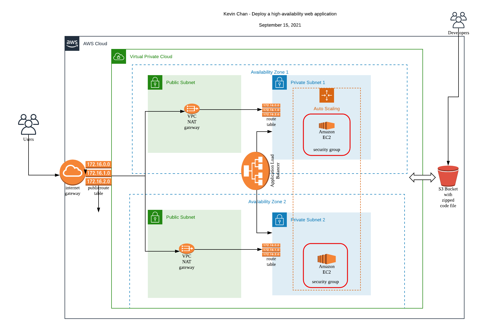

# Deploy-a-High-Availability-Web-App-Using-CloudFormation

### Second project of the Udacity Cloud DevOps Nanodegree program.

> In this project, I deployed web servers for a highly available web app using CloudFormation.
> I wrote the code that creates and deploys the infrastructure and application from the ground up,
> following best practices and scripting as much as possible.

## Create Stack

./create.sh udagram udagram.yml udagram.json

## Project Description

Application archive from an S3 Bucket will be downloaded to application server EC2 instances, IAM Role was created that allows the instances to use the S3 Service.

Udagram communicates on the default HTTP Port: 80, so the servers will need this inbound port open since the application will use it with the Load Balancer and the Load Balancer Health Check. As for outbound, the servers will need unrestricted internet access to be able to download and update their software.

The load balancer was configured to allow all public traffic (0.0.0.0/0) on port 80 inbound, which is the default HTTP port. Outbound, it has been only used port 80 to reach the internal servers.

The application has been deployed into private subnets with a Load Balancer located in a public subnet.

One of the output exports of the CloudFormation script was the public URL of the LoadBalancer. The "http://" prefix has been added in front of the load balancer DNS Name in the output, for convenience.
